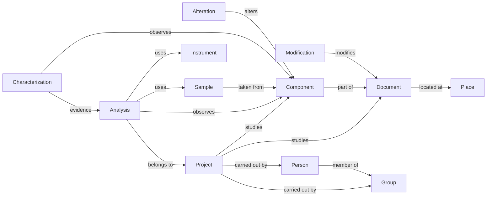

# ManuSpectrum package

The data model and reference vocabularies of [ManuSpectrum](https://github.com/CRC-Centre-Recherche-Conservation/ManuSpectrum): a platform for heritage manuscripts and their scientific analyses, built on [Arches](https://www.archesproject.org).

[](LICENSE)
[](https://www.archesproject.org)
[](.github/workflows/load.yml)
[](.github/workflows)

## What's inside

| Part | Content |
| --- | --- |
| `graphs/resource_models` | 12 resource models |
| `graphs/branches` | 10 reusable branches |
| `reference_data/controlled_lists` | 39 controlled lists, 6,633 terms, labels in 11 languages (ar, de, el, en, es, fr, he, it, nl, pt, ru) |
| `ontologies/cidoc_crm` | CIDOC CRM 7.1.2, CRMsci, CRMtex, LRMoo |
| `system_settings`, `package_config.json` | project settings and relationship constraints |
| `post_sql` | marks the lists as searchable after loading |
| `expected-inventory.json` | counts and digests a correct load must reproduce |
| `map_layers` | empty: the maps use Arches' own layers |

## Main models



## Use it

This package is loaded through the [ManuSpectrum application](https://github.com/CRC-Centre-Recherche-Conservation/ManuSpectrum), not into a bare Arches project: the models use the application's datatypes and functions (`functions_x_graphs`), and the application's migrations register the workflow plugins. The application loads it for you when its database is initialised (`make init`; the package is its `pkg` submodule).

To load it by hand into a ManuSpectrum database, from the application:

```bash
python manage.py packages -o load_package -s /path/to/this/package -y
```

> [!WARNING]
> Set `PUBLIC_SERVER_ADDRESS=https://manuspectrum.huma-num.fr/` (with the trailing slash) before loading; the application's `ARCHES_NAMESPACE_FOR_DATA_EXPORT` must equal it. Term identifiers in the lists are built on that address; with another one the sort order of the lists is lost without any error.

After loading, compare the database with `expected-inventory.json`:

```bash
python manage.py check_pkg_inventory /path/to/this/package/expected-inventory.json
```

## Regenerate it

From the ManuSpectrum app, on a development copy of the data (never on production):

```bash
python manage.py export_pkg --out /path/to/this/package --force \
  --public-origin https://manuspectrum.huma-num.fr/
```

The command rewrites development addresses, refuses to finish if one is left, and writes the inventory. `--force` clears and rewrites only the folders it manages (graphs, lists, settings, `package_config.json`, the inventory); the other files of the package, such as `.github/`, are neither read nor changed.

## What's not here

No business data (resources, tiles, files), no accounts, no keys or passwords. The old thesauri (`concepts`, `collections`) were removed; they remain in the Git history.

## Credits and licence

Original content: [CC BY 4.0](LICENSE). The controlled lists and ontologies build on third-party sources, each of which keeps its own licence: the Getty Art & Architecture Thesaurus (ODC-By 1.0), the INHA AGORHA thesauri (CC BY 4.0), the Frantiq PACTOLS thesaurus (ODbL 1.0), the Loterre periodic table of the elements (CC BY 4.0, Inist-CNRS), the Frollo TAPAC thesaurus of analysis techniques (no licence stated by its provider), and the CIDOC CRM 7.1.2, CRMsci, CRMtex and LRMoo ontologies (CC BY 4.0). Recommended citations, the lists derived from each source, licence links and the attribution texts that Getty and Frantiq ask for are in [NOTICE](NOTICE). Arches is AGPL-3.0 and is not included.

## Links

- Application: <https://github.com/CRC-Centre-Recherche-Conservation/ManuSpectrum>
- Platform: <https://www.archesproject.org>
